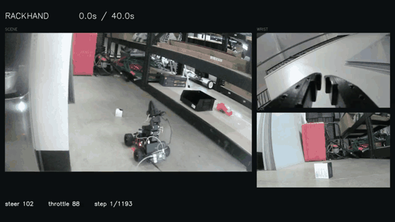
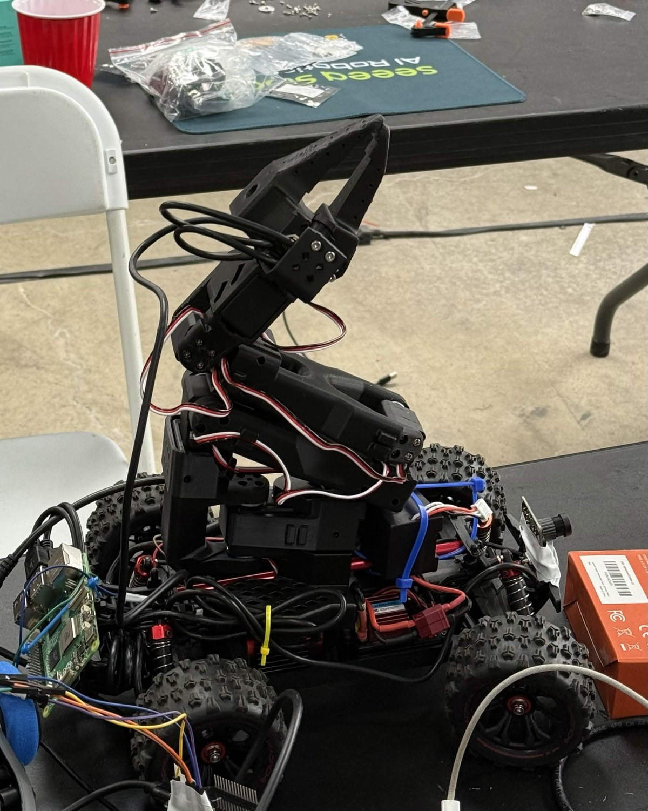
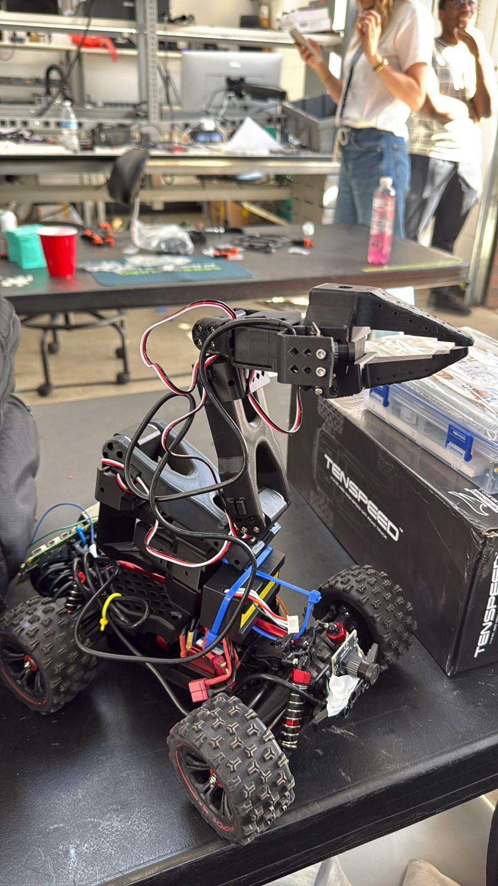

# RackHand

**An SO-101 arm on an RC car — teleoperate, record demonstrations, and replay them.**

RackHand combines a leader/follower arm pair, a Raspberry Pi 5, an ESP32-connected
radio controller, and three cameras. Drive to an object, pick it up, carry it to a
bin, and drop it in. Record the arm targets, measured joint positions, controller
signals and camera views together for training and inspection.

## Demo

<video src="https://github.com/HariOmChadha/RackHand/raw/refs/heads/main/docs/assets/demo.mp4" controls playsinline preload="metadata" poster="docs/assets/demo-poster.jpg" width="960">
  <a href="docs/assets/demo.mp4">Watch the RackHand demo</a>
</video>

[](https://github.com/HariOmChadha/RackHand/raw/refs/heads/main/docs/assets/demo.mp4)

**[Watch the full 40-second video](https://github.com/HariOmChadha/RackHand/raw/refs/heads/main/docs/assets/demo.mp4)**
· [Project page source](docs/index.html)

The animation is a short preview for Markdown viewers without inline video support.
The full video shows a recorded demonstration with three views on one timeline,
plus steering/throttle telemetry. It is not evidence of an autonomous policy run.
Open `docs/index.html` locally for the project page and embedded MP4 player.

<p>
  
  
</p>

## How it works

```text
LAPTOP                                      RASPBERRY PI 5 ON CAR
Leader arm ── USB ──┐                       ┌── USB ── Follower arm
Scene camera ─ USB ─┼── Record / control ────┼── USB ── Wrist camera
Controller ESP ────┘     Ethernet / Wi-Fi   └── USB ── Car camera
       │
       └── DAC → handheld transmitter → radio → RC car
```

The Pi hosts the follower and two cameras. The laptop hosts the leader, scene camera
and controller ESP32. Ethernet or Wi-Fi carries joint commands, feedback and JPEG
frames; USB devices do not need to be forwarded over the network. Cameras have
stable roles (`scene`, `wrist`, `car`) independent of their USB device numbers.
Arm servo power is separate from USB power.

| Capability | What is implemented |
| --- | --- |
| Teleoperation | Leader targets sent to the follower with feedback, step limits and a command-loss watchdog |
| Recording | Timestamped JSONL + JPEGs, four Enter-triggered phases, good/bad review after Ctrl+C |
| Cameras | Per-camera profiles, device discovery, probes and interchangeable camera experiments |
| Networking | Saved Ethernet/Wi-Fi endpoints and observation benchmarks |
| Replay | Synchronized video rendering; opt-in recorded arm + raw DAC command streaming |
| Hosted policy | PI Fleet π0.7 adapter for scene/wrist observations and arm + car actions |

## Try it without hardware

Linux, Python **3.12+** and its venv support are required. From a fresh clone:

```bash
git clone https://github.com/HariOmChadha/RackHand.git
cd RackHand
python3.12 -m venv .venv
source .venv/bin/activate
python -m pip install -r requirements-wireless.txt -r requirements-replay.txt
./robot simulate --duration 10
```

This starts a simulated Pi and laptop over real localhost TCP, records synthetic
camera frames, validates saved data, and checks the arm watchdog. It never opens
physical USB devices. Simulation output goes to ignored `data/validation/`.

## Record with the robot

Follow [hardware setup](docs/SETUP.md) first: install the pinned LeRobot driver,
copy the config templates to ignored `*.local.json` files, identify serial/camera
paths, load each arm's own calibration, and provision the same private robot token
on both computers. The leader stays on the laptop; the follower stays on the Pi.

On the Pi, with the arm supported and the workspace clear:

```bash
./robot pi
```

On the laptop, after configuration:

```bash
./robot set-pi YOUR_PI_IP
./robot check
./robot record --enable-motion
```

During recording, **Enter** advances through:

1. drive to object
2. pick up object
3. drive to the bin
4. drop in bin

**Ctrl+C** finishes and saves the episode. Enter `g` for good or `b` for bad;
Enter alone leaves it unreviewed. Run the same recording command for another episode.

```text
training_dataset/
├── good/episode_.../
├── bad/episode_.../
└── unreviewed/episode_.../
    ├── metadata.json
    ├── telemetry.jsonl
    └── images/
```

These are raw captures, not a converted LeRobot training dataset. Rows distinguish
leader targets, applied follower targets and measured follower state. Car values
are **steering, then throttle, in raw DAC units**. A 30 Hz control loop can reference
repeated camera frames; it does not mean every camera captured 30 unique frames/s.

## Useful commands

Run from the repository root; `./robot` selects the local Python environment.

| Command | Purpose |
| --- | --- |
| `./robot devices` | Inspect connected serial/video devices |
| `./robot ethernet --host PI_ETHERNET_IP` | Save and select the Pi's Ethernet address |
| `./robot wifi --host PI_WIFI_IP` | Save and select the Pi's Wi-Fi address |
| `./robot network` | Show saved endpoints; does not test connectivity |
| `./robot cameras --help` | Select camera roles/profiles and probe devices |
| `./robot benchmark --duration 30` | Measure observations with the Pi in `--read-only` mode |
| `./robot replay EPISODE_OR_DIRECTORY --play` | Render/open synchronized camera playback |
| `./robot classify EPISODE_DIRECTORY good` | Classify a completed recording later |
| `./robot simulate --infer --duration 5` | Exercise policy control with simulated hardware |

Network selection changes endpoints, not either computer's Wi-Fi connection.
Stop recording before switching. See [camera experiments](docs/CAMERA_EXPERIMENTS.md)
and [replay](docs/REPLAY.md) for options and prerequisites.

## Inference and physical replay status

The PI Fleet adapter has completed one non-actuating hosted request: ten predicted
actions in about **2.07 seconds**. Physical policy task success is **not verified**.
The current runner waits between action chunks; it does not provide continuous
30 Hz policy predictions. Exact training neutral/preprocessing and verified physical
stop values are still needed before enabling autonomous car control.

Recorded command replay is implemented and tested against simulated hardware;
physical replay remains unverified. It requires matching calibration, a nearby
starting arm pose, verified car neutral and updated ESP firmware. Replaying commands
does not guarantee the same physical trajectory.

See [inference setup](docs/INFERENCE.md) and [robot replay](docs/REPLAY.md).
Both require explicit `--enable-motion`. Video playback never commands hardware.
Software watchdogs supplement operator supervision; they are not a physical stop.

## Development and private files

```bash
python -m pip install -r requirements-test.txt
python -m pytest -q
python -m ruff check mobile_robot scripts tests
python scripts/check_secrets.py --staged
```

The maintained code lives in `mobile_robot/`; ESP32 firmware lives in
`esp32_controller/`. Tests cover protocol faults, recording, camera handling,
phase changes, policy conversion, firmware DAC routing and replay. Optional driver
and private SDK tests skip when those dependencies are unavailable.

Credentials belong in ignored `.env`, `.robot-token` and `data/credentials/`.
Datasets, calibration, local configs, environments and deployment archives stay
out of Git. Never commit a populated credential file. Read the
[development guide](docs/DEVELOPMENT.md) for the layout, test coverage, secret checks
and migration from older scripts. [Field notes](docs/FIELD_NOTES.md) preserve the
original deployment measurements separately from the setup guide.
